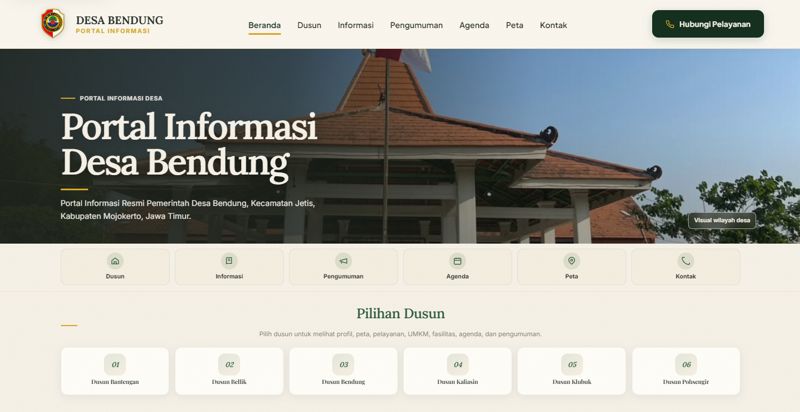
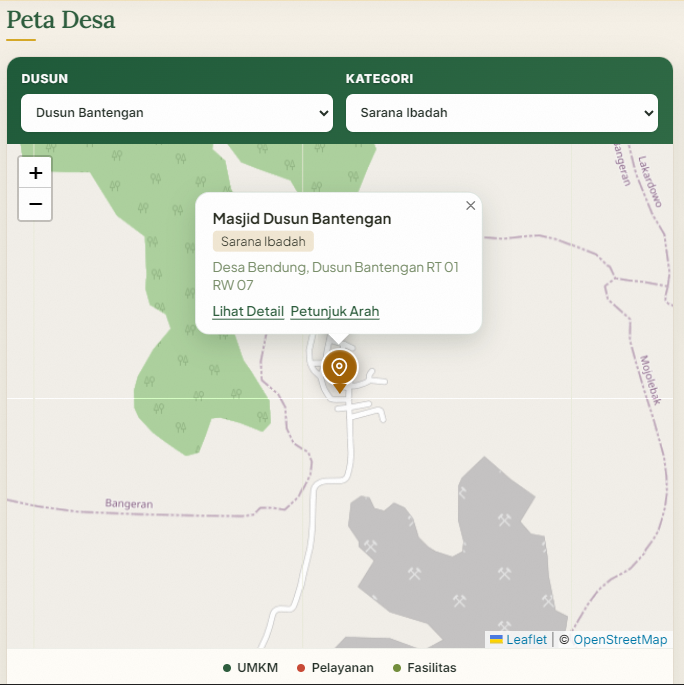
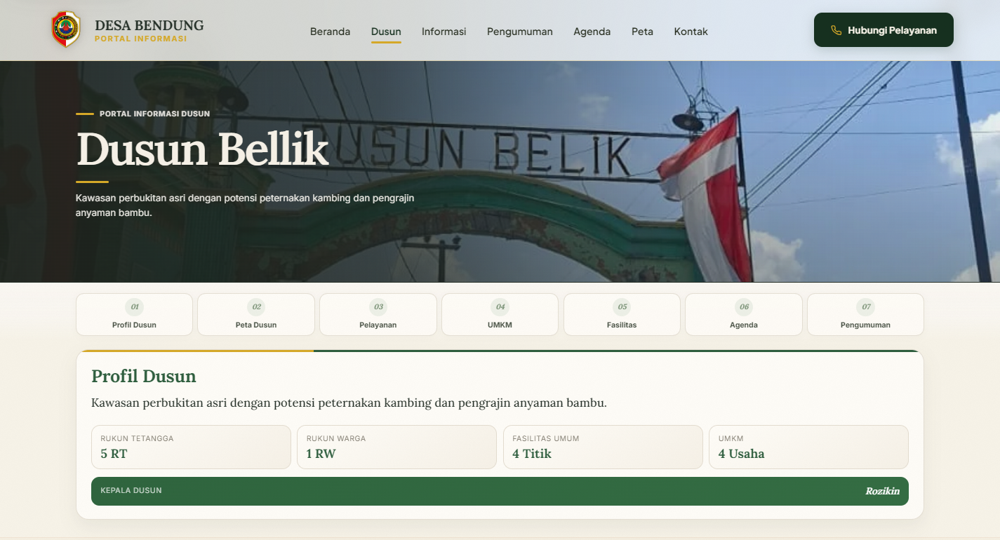
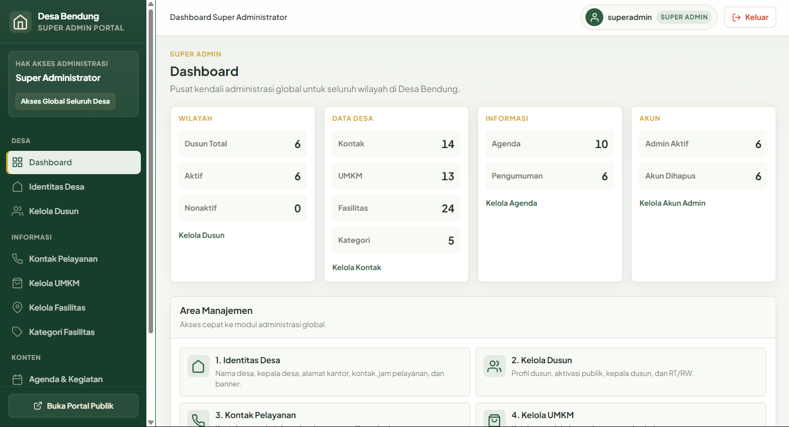
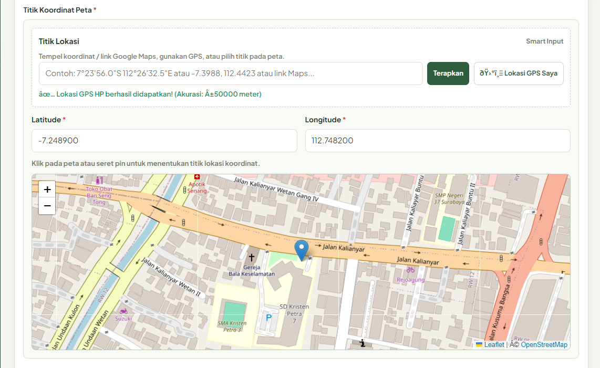
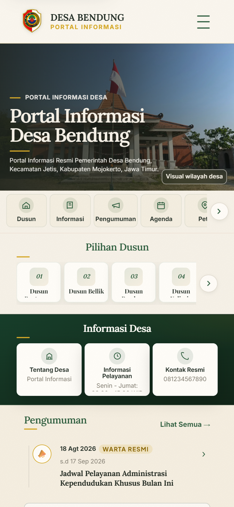
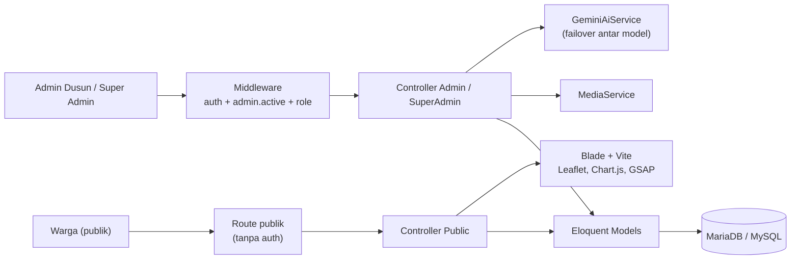

<h1 align="center">Portal Informasi Desa Bendung</h1>

<p align="center">
  <strong>Portal informasi desa multi-dusun dengan peta interaktif, panel admin berlapis peran, dan asisten penulisan berbasis AI</strong>
</p>

<p align="center">
  
  
  
  
  
  
  
</p>

<p align="center">
  
</p>

---

## Ringkasan

Portal ini dibangun pada program KKN untuk **Desa Bendung**. Sebelumnya informasi desa tersebar di grup chat dan papan pengumuman. Portal ini menyatukan profil desa, dusun, UMKM, fasilitas umum, agenda, dan pengumuman dalam satu situs yang bisa dibuka dari ponsel.

Perangkat desa mengelola konten lewat panel admin. Admin dusun mengurus data dusunnya sendiri, sedangkan Super Admin mengelola data seluruh desa. Proyek ini dilengkapi dokumentasi rekayasa lengkap, mulai dari kebutuhan, PRD, SRS, ERD, sampai buku panduan pengguna dan berkas pengajuan HKI.

## Masalah dan Solusi

| Masalah di lapangan | Solusi di portal |
| :--- | :--- |
| Informasi desa tersebar dan cepat tenggelam di chat | Satu portal publik dengan halaman per dusun, arsip pengumuman, dan agenda kegiatan |
| Lokasi UMKM dan fasilitas sulit ditemukan | Peta interaktif Leaflet dengan popup detail dan tombol petunjuk arah ke Google Maps |
| Admin dusun kesulitan menulis pengumuman yang rapi | Asisten AI yang membuat draf teks, dengan failover otomatis antar model |
| Satu akun admin bisa mengubah data dusun lain | Role `super_admin` dan `admin_dusun`, ditegakkan lewat middleware dan diuji secara otomatis |
| Warga memerlukan nomor layanan desa | Kontak pelayanan dengan tautan langsung ke WhatsApp |
| Pengelola desa berganti, pengetahuan hilang | Buku panduan, SRS, dan runbook operasional ada di folder `docs/` |

## Tampilan

<table>
  <tr>
    <td width="50%"><br /><sub><b>Peta interaktif</b> dengan popup lokasi</sub></td>
    <td width="50%"><br /><sub><b>Halaman dusun</b> dengan profil, UMKM, dan fasilitas</sub></td>
  </tr>
  <tr>
    <td width="50%"><br /><sub><b>Dashboard Super Admin</b> untuk seluruh desa</sub></td>
    <td width="50%"><br /><sub><b>Smart input koordinat</b> dari GPS atau tautan peta</sub></td>
  </tr>
  <tr>
    <td colspan="2" align="center"><br /><sub><b>Mobile-first</b>, karena sebagian besar warga mengakses lewat ponsel</sub></td>
  </tr>
</table>

## Fitur

### Portal publik
* **Beranda** berisi profil desa, ringkasan dusun, agenda, dan pengumuman terkini.
* **Halaman dusun** (`/dusun/{id}`) menampilkan profil, peta, UMKM, fasilitas, dan kontak setiap dusun.
* **Detail UMKM, fasilitas, agenda, dan pengumuman**, plus **arsip pengumuman**.
* **Peta interaktif** dengan penanda per kategori fasilitas dan navigasi ke Google Maps.
* **Kontak pelayanan** dengan tautan WhatsApp.

### Panel admin
* **Admin Dusun** mengelola profil dusun, UMKM beserta produk, fasilitas, agenda, pengumuman, dan kontak pelayanan.
* **Super Admin** mengelola identitas desa, dusun, kategori fasilitas, data peta, akun admin dusun, dan data global lintas dusun, termasuk pemulihan data yang dihapus.
* **Upload media** diproses `MediaService` dengan validasi file.
* **Coordinate resolver** mengubah tautan Google Maps atau koordinat mentah menjadi titik peta dan menolak input berbahaya.
* **AI draft assistant** membuat draf pengumuman atau deskripsi. Endpoint dibatasi `throttle:60,1`.

## Arsitektur



### Keputusan teknis
* **Otorisasi berlapis.** Middleware `EnsureRole` dan `EnsureAdminAccountActive` memeriksa peran dan status akun. Admin dusun dibatasi pada scope dusunnya, dan batas itu diuji di `CrossRoleSecurityTest` serta `AuthorizationInvariantTest`.
* **AI yang tahan gangguan.** `GeminiAiService` menjalankan daftar model cadangan secara berurutan saat terkena rate limit dan mencatat model yang dipakai serta latensinya. Provider, model, dan API key diatur lewat environment.
* **Waktu yang konsisten.** Data disimpan dalam UTC, sedangkan tampilan memakai `Asia/Jakarta`.
* **Hosting sederhana.** Session dan cache berbasis file, dan queue berjalan sinkron. Portal bisa dijalankan di shared hosting.
* **Perlindungan file sensitif.** `.htaccess` memblokir akses web ke `docs/`, `src/app`, `src/config`, `src/database`, `.env`, dan direktori internal lain. Semua request publik diarahkan ke `src/public/`.
* **Soft delete dan pemulihan.** Data yang dihapus dapat dipulihkan oleh Super Admin.

## Peta Kode

| Lokasi | Tanggung jawab |
| :--- | :--- |
| `src/routes/web.php` | Rute publik, autentikasi, Admin Dusun, dan Super Admin |
| `src/app/Http/Controllers/Public/` | Controller halaman publik |
| `src/app/Http/Controllers/Admin/` | Controller panel Admin Dusun |
| `src/app/Http/Controllers/SuperAdmin/` | Controller panel Super Admin |
| `src/app/Http/Middleware/` | `EnsureRole`, `EnsureAdminAccountActive` |
| `src/app/Services/GeminiAiService.php` | Klien AI dengan failover model |
| `src/app/Services/MediaService.php` | Upload dan validasi media |
| `src/app/Models/` | Desa, Dusun, Umkm, ProdukUmkm, Fasilitas, KategoriFasilitas, AgendaKegiatan, Pengumuman, KontakPelayanan, AdminAccount |
| `src/resources/js/map.js` | Logika peta Leaflet |
| `src/tests/Feature/` | Uji fitur untuk modul Public, Admin, SuperAdmin, Auth, dan Authorization |

## Tech Stack

| Lapisan | Teknologi |
| :--- | :--- |
| Backend | Laravel 13, PHP 8.3+ |
| Database | MariaDB / MySQL |
| Frontend | Blade, CSS mobile-first, JavaScript progresif |
| Build | Vite 8 dan `laravel-vite-plugin` |
| Peta dan visual | Leaflet, Chart.js, GSAP |
| AI | Gemini (dapat dikonfigurasi lewat `AI_PROVIDER`, `AI_MODEL`) |
| Kualitas kode | PHPUnit 12, Laravel Pint |

## Menjalankan Secara Lokal

**Prasyarat:** PHP 8.3+, Composer, Node.js 20+, dan MariaDB/MySQL.

```bash
git clone https://github.com/karangsawo123/proker-kkn.git
cd proker-kkn/src

# Instalasi, salin .env, generate key, dan build aset
composer setup
```

Atur koneksi database dan kunci AI di `src/.env`:

```env
DB_CONNECTION=mariadb
DB_HOST=127.0.0.1
DB_DATABASE=desa_bendung
DB_USERNAME=root
DB_PASSWORD=

# Opsional, fitur asisten AI nonaktif atau gagal jika kosong
AI_PROVIDER=gemini
AI_MODEL=gemini-2.5-flash-lite
GEMINI_API_KEY=isi-kunci-anda
```

```bash
php artisan migrate --seed
composer dev          # server pengembangan
```

### Pengujian dan kualitas kode

```bash
composer test                  # menjalankan seluruh test suite
./vendor/bin/pint              # merapikan gaya kode PHP
```

## Dokumentasi

Proyek ini mengikuti alur rekayasa perangkat lunak yang terdokumentasi:

| Folder | Isi |
| :--- | :--- |
| [`docs/01-requirements`](docs/01-requirements) | Baseline kebutuhan |
| [`docs/02-product`](docs/02-product/PRD.md) | Product Requirements Document |
| [`docs/03-ux`](docs/03-ux) | Sitemap, user flow, wireframe, spesifikasi visual, mockup, dan eksplorasi redesain |
| [`docs/04-system`](docs/04-system) | ERD, skema database fisik, peran dan izin |
| [`docs/05-rnd`](docs/05-rnd/technical-rnd.md) | Riset teknis |
| [`docs/06-specification`](docs/06-specification/SRS.md) | Software Requirements Specification |
| [`docs/07-testing`](docs/07-testing) | Spesifikasi pengujian, laporan eksekusi, dan register defect |
| [`docs/07-handover`](docs/07-handover/README.md) | Buku panduan pengguna, aset, naskah sosialisasi, dan berkas HKI |
| [`docs/08-operations`](docs/08-operations/preproduction-readiness.md) | Kesiapan pra-produksi |

## Struktur Repositori

```text
proker-kkn/
├── docs/                 # Dokumentasi rekayasa, UX, pengujian, dan serah terima
├── src/                  # Aplikasi Laravel
│   ├── app/              # Controller, Model, Middleware, Service
│   ├── database/         # Migrasi, seeder, factory
│   ├── resources/        # View Blade, CSS, JavaScript
│   ├── routes/           # Definisi rute
│   ├── tests/            # PHPUnit (Feature dan Unit)
│   └── public/           # Document root aplikasi
├── .htaccess             # Pengalihan ke src/public dan blokir path sensitif
└── README.md
```

## Pembelajaran Utama

1. **Mengerjakan dari kebutuhan nyata.** Pertanyaan ke pihak desa dikumpulkan di `docs/00-sources`, lalu diturunkan menjadi requirement, PRD, dan SRS.
2. **Keamanan sebagai hasil uji.** Aturan akses antar peran dibuktikan oleh test otomatis dan tidak hanya diasumsikan benar.
3. **Serah terima yang bisa dipakai.** Hasil akhirnya mencakup buku panduan, naskah sosialisasi, dan dokumen operasional, sehingga pengelola berikutnya tidak perlu memulai dari nol.

## Pengembang

**M. Dicky Andrean**
GitHub: [@karangsawo123](https://github.com/karangsawo123) · LinkedIn: [linkedin.com/in/DickyAndrean](https://www.linkedin.com/in/DickyAndrean) · Email: karangsawo123@gmail.com

---

<p align="center">
  <sub>Dibuat untuk Desa Bendung sebagai bagian dari program KKN.</sub>
</p>
